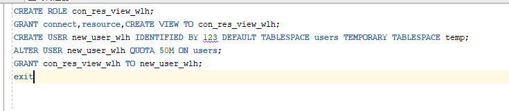
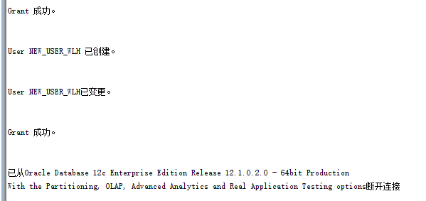
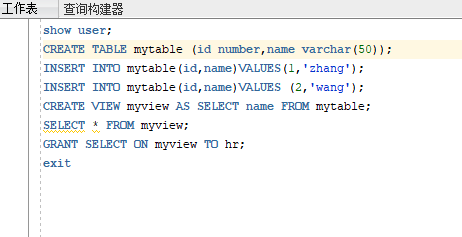
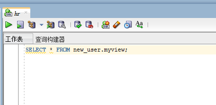

# 实验2：用户及权限管理
### 训练要求:     

- 在pdborcl插接式数据中创建一个新的本地角色con_res_view，该角色包含connect和resource角色，同时也包含CREATE VIEW权限，这样任何拥有con_res_view的用户就同时拥有这三种权限。

- 创建角色之后，再创建用户new_user，给用户分配表空间，设置限额为50M，授予con_res_view角色。

- 最后测试：用新用户new_user连接数据库、创建表，插入数据，创建视图，查询表和视图的数据。

### 实验步骤：

- 以system登录到pdborcl，创建角色CON_RES_VIEW_WLH和用户NEW_USER_WLH，并授权和分配空间：

    

    
    
- 新用户NEW_USER_WLH连接到pdborcl，创建表MYTABLE和视图MYVIEW，插入数据，最后将MYVIEW的SELECT对象权限授予HR用户。

      
    
-  用户HR连接到pdborcl，查询NEW_USER_ZLH授予它的视图MYVIEW

      