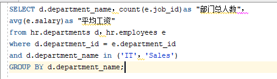
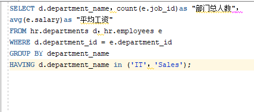
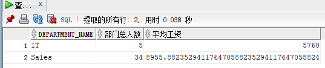
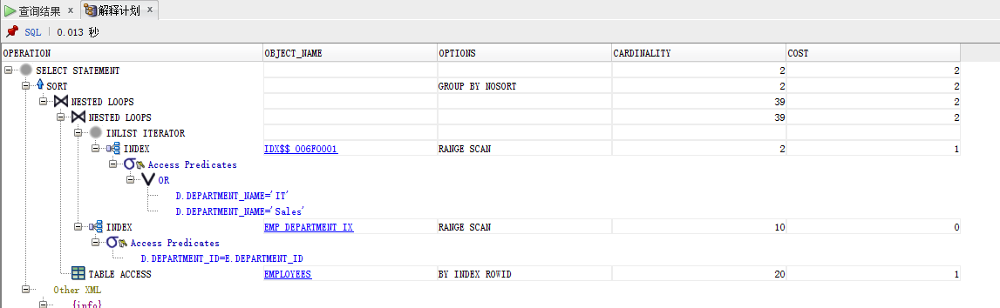
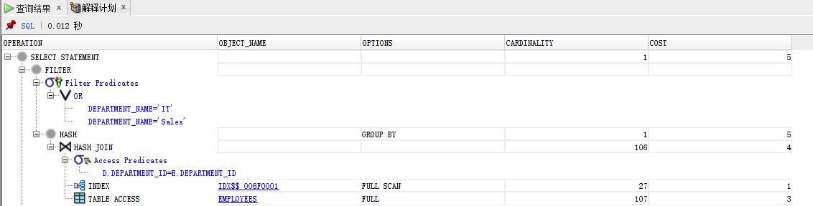
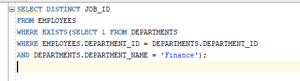
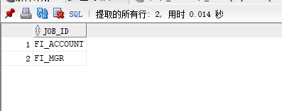
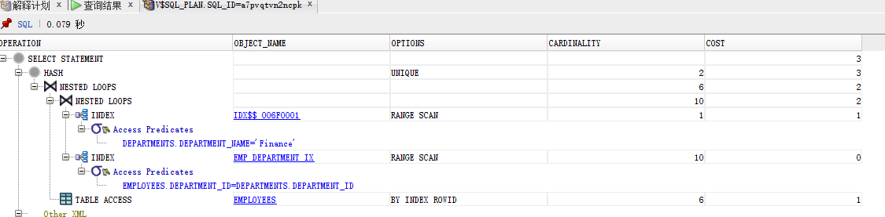

## 实验一：SQL实验执行语句，优化指导
### 教材中的查询语句：                          
- Query 1

        
- Query 2            
       
###结果：                                 
- Result 1:                                       
                              
- Result 2:   
 
 ###分析：
   - Analysis 1:                                            
    
   - Analysis 2:     
   
   My anlysis:      
   Query1的查询消耗的内存少于Query2的内存，且Query1采用索引扫描，Query2用的是全表两者相比，Query 1的查询效率更高
   ### 我的查询语句：      
   - Code:         
   
   - Result:    
   
   - Analysis   
   