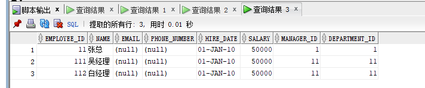
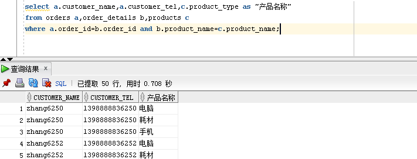
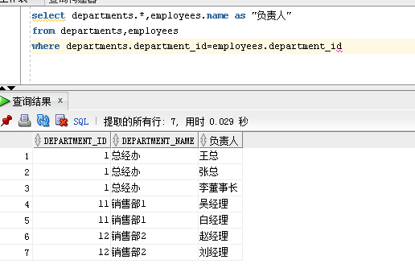

## 实验四：对象管理
###实验步骤：
####1.录入数据：
        要求至少有1万个订单，每个订单至少有4个详单。至少有两个部门，每个部门至少有1个员工，其中只有一个人没有领导，一个领导至少有一个下属，并且它的下属是另一个人的领导（比如A领导B，B领导C）。
####2.序列的应用:
        插入ORDERS和ORDER_DETAILS 两个表的数据时，主键ORDERS.ORDER_ID, ORDER_DETAILS.ID的值必须通过序列SEQ_ORDER_ID和SEQ_ORDER_ID取得，不能手工输入一个数字。 
####3.查询语句：
   - Query 1:查询某个员工的信息。                                                  

           select * from ORDERS where  order_id=1;
           select * from ORDER_DETAILS where  order_id=1;
           select * from VIEW_ORDER_DETAILS where order_id=1;                                    
                    
   - Query 2:递归查询某个员工及其所有下属，子下属员工。 
        
           WITH A (EMPLOYEE_ID,NAME,EMAIL,PHONE_NUMBER,HIRE_DATE,SALARY,MANAGER_ID,DEPARTMENT_ID) AS
             (SELECT EMPLOYEE_ID,NAME,EMAIL,PHONE_NUMBER,HIRE_DATE,SALARY,MANAGER_ID,DEPARTMENT_ID
               FROM employees WHERE employee_ID = 11
               UNION ALL
             SELECT B.EMPLOYEE_ID,B.NAME,B.EMAIL,B.PHONE_NUMBER,B.HIRE_DATE,B.SALARY,B.MANAGER_ID,B.DEPARTMENT_ID
               FROM A, employees B WHERE A.EMPLOYEE_ID = B.MANAGER_ID)
           SELECT * FROM A;\
           
      
    - Query 3:查询订单表，并且包括订单的订单应收货款。
    
      
   - Query 4:查询订单详表，要求显示订单的客户名称和客户电话，产品类型用汉字描述。
   
     
    - Query 5：查询出所有空订单，即没有订单详单的订单。
     
         select orders.*
         from orders a left join order_details b
         on a.order_id=b.order_id
         where b.order_id is null
   - Query 6：查询部门表，同时显示部门的负责人姓名。
      
            select departments.*,employees.name as "负责人"
            from departments,employees
            where departments.department_id=employees.department_id
     
   - Query 7：查询部门表，统计每个部门的销售总金额。
   
           select a.department_name,(select sum(c.Trade_Receivable)from orders c  where c.employee_id=d.employee_id group by c.employee_id)as "销售总额"
           from departments a,employees b,orders d
           where a.department_id=b.department_id
           and d.employee_id=b.employee_id